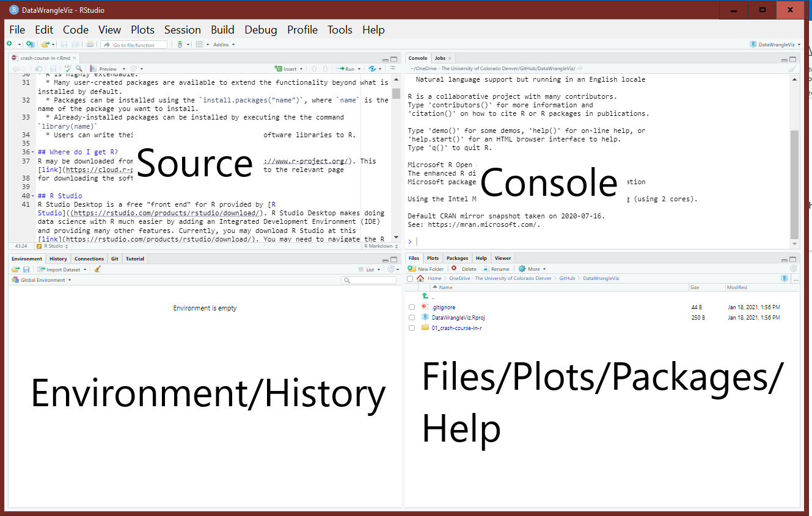

```{r, include=FALSE}
# change Console output behavior
knitr::opts_chunk$set(collapse = TRUE)
```

This notebook is intended to help you quickly learn how to productively use R.

An accompanying YouTube playlist that walks through this notebook is available
by following the link [here](https://www.youtube.com/playlist?list=PLkrJrLs7xfbUNe79bzEetcE0g-vHZT8XR). 

# Introduction

## What is R?

* R is programming language and environment designed for statistical computing.
  * It is modeled after the _S_ programming language.
  * It was introduced by Robert Gentleman and Robert Ihaka in 1993.
* R is free, open source, and runs on Windows, Macs, Linux, and other types of computers.
* R is an interactive programming language
  * You type and execute a command in the Console for immediate feedback in contrast to a compiled programming language, which compiles a program that is then executed.
* R is highly extendable.
  * Many user-created packages are available to extend the functionality beyond what is installed by default.
  * Users can write their own functions and easily add software libraries to R.

## Where do I get R?
R may be downloaded from the R Project's [website](https://www.r-project.org/). This [link](https://cloud.r-project.org/) *should* bring you to the relevant page
for downloading the software.

## R Studio
R Studio Desktop is a free "front end" for R provided by [R Studio](https://rstudio.com/). R Studio Desktop makes doing data science with R much easier by adding an Integrated Development Environment (IDE) and providing many other features. Currently, you may download R Studio at this [link](https://rstudio.com/products/rstudio/download/). You may need to navigate the R Studio website directly.

R Studio has four panes:

1. Source: the pane where you type your commands, which can be saved for later.
2. Console: the pane where the code is executed.
3. Environment/History: the pane where you can see all the objects in your workspace, your command history, and other things in other contexts.
4. The Files/Plot/Packages/Help: the pane where you navigate between directories, where plots can be viewed, where you can see the packages available to be loaded, and where you can get help.



## Running code and scripts
Code is executed in R by typing it in the Console and hitting enter.

### Your turn
Type `1+1` in the R Console and hit enter.

```{r, eval = FALSE}
1 + 1
```

## Creating a new script
Instead of typing all of your code in the Console and hitting enter, it's better to write your code in a Script. The Script is just a text file with all the commands you want to execute. A new script can be obtained by executing File -> New File -> R Script or pressing "Ctrl + Shift + n" (on a PC) or "Cmd + Shift + n" on a Mac.

### Your turn
Open a new Script in R Studio.

## Running code from a Script
There are various ways to run code from a Script file. The most common ones are:
1. Highlight the code you want to run and hit the Run botton at the top of the Script pane.
2. Highlight the code you want to run and press "Ctrl + Enter" on your keyboard. If you don't highlight anything, by default, R Studio runs the command the cursor currently lies on.

### Your turn
Type `mean(c(1:3))` in your Script file.

Run the command using the approaches mentioned above.

## Saving a Script
To save a script, click File -> Save or press "Ctrl + s" (on a PC) or "Cmd + s" (on a Mac).

### Your turn
Save your script

## Packages
Packages are collections of functions, data, and other objects that extend the functionality installed by default in R. 

R packages can be installed using the `install.packages` function and loaded using the `library` function.

## Your turn
The **tidyverse** [https://www.tidyverse.org](https://www.tidyverse.org) is an ecosystem of R packages that we will use extensively in this class. Currently, the **tidyverse** is comprised of the following packages:

* **ggplot2** - A package for plotting based on the "Grammar of Graphics".
* **purrr** - A complete and consistent functional programming toolkit for R.
* **tibble** - An advanced data frame.
* **dplyr** - A grammar of data manipulation, providing a consistent set of verbs that help you solve the most common data manipulation challenge
* **tidyr** - Tools to help to create tidy data, where each column is a variable, each row is an observation, and each cell contains a single value. 'tidyr' contains tools for changing the shape (pivoting) and hierarchy (nesting and 'unnesting') of a dataset, turning deeply nested lists into rectangular data frames ('rectangling'), and extracting values out of string columns. It also includes tools for working with missing values (both implicit and explicit).
* **stringr** - A package for working with character/string data.
* **readr** - A package for importing data.
* **forcats** - A package for working with categorical data.

Install the set of **tidyverse** R packages by executing the following command:
```{r, eval=FALSE}
install.packages("tidyverse")
```

After you install **tidyverse**, load the package(s) by executing the following command:

```{r, eval=FALSE}
library(tidyverse)
```

You should see something like this.

```{r, echo=FALSE, results='markup'}
library(tidyverse)
```

## Comments
A comment refers to internal documentation that the compiler/interpreter should not execute. Comments are essentially reminders to yourself or others about what the code is supposed to do, why you did it a certain way, etc.

A comment is indicated by the `#` symbol. Nothing to the right of the `#` is executed in the Console.

To comment (or uncomment) multiple lines in R, highlight the code you want to comment and press "Ctrl + Shift + c" on a PC or "Cmd + Shift + c" on a Mac.

An examples:

```{r}
1 + 1 # adding 1 + 1
# 2 + 2 (not adding 2 + 2 because of the #)
```


# Getting help

There are a number of helps to get help in R. 

* If you know the command for which you want help, then `?command` (where command is replaced the name of the relevant command) will bring up the documentation for the object.
  * This also may work with data sets, package names, object classes, etc.
* If you need to find a command to help you with a certain *topic*, then `??topic` will search for the topic through all installed documentation and bring up any vignettes, code demonstrations, or help pages that include the topic for which you searched.
* If you are trying to figure out why an error is being produced, what packages can be used to perform a certain analysis, how to perform a complex task that you can't seem to figure out, etc., then simply do a web search for what you're trying to figure out! Because R is such a popular language, it is likely you will find a stackoverflow response, a blog, an R users forum response, etc., that at least partially addresses your question.

## Your turn

The `lm` command can be used to fit a linear model to a set of data. Use `?lm` to get help about the `lm` function.

A [logarithm](https://www.dictionary.com/browse/logarithm?s=t) is, "The exponent of the power to which a base number must be raised to equal a given number." e.g., $\log_{10}(100)=2$ since $10^2=100$. What function is used to compute the *natural* logarithm (base $e\approx 2.718281828459$) in R? Use `??logarithm` to find the R functions that may provide this functionality.

Suppose you want to change the x-axis label of a plot in R. Do a web search to see if you can figure out how to do this.

# Data types and structures

## Basic data types
R has 6 basic ("atomic") [vector types](https://cran.r-project.org/doc/manuals/r-release/R-lang.html#Basic-types):

1. character - collections of characters. E.g., `"a"`, "hello world!"
2. double - decimal numbers. e.g., `1.2`, `1.0`
3. integer - whole numbers. In R, you must add `L` to the end of a number to specify it as an integer. E.g., `1L` is an integer but `1` is a double.
4. logical - boolean values, `TRUE` and `FALSE`
5. complex - complex numbers. E.g., `1+3i`
6. raw - a type to hold raw bytes. 

Both double and integer values are specific types of numeric values.

The `typeof` function returns the R internal type or storage mode of any object.

```{r}
typeof(1)
typeof(1L)
typeof("hello world!")
```

## Other important object types

There are other important types of objects in R that are not basic. We will discuss a few. The [R Project manual](https://cran.r-project.org/doc/manuals/r-release/R-lang.html#Basic-types) provides additional information about available types.

### Numeric
An object is `numeric` if it is of type `integer` or `double`. In that case, it's `mode` is said to be `numeric`. 

The `is.numeric` function tests whether an object can be interpreted as numbers. We can use it to determine whether an object is `numeric`. Alternatively, we can use the `mode` function to get the type or storage mode of an object.

Some examples:
```{r}
mode("hello world!")
is.numeric(1)
mode(1)
is.numeric(1L)
mode(1)
```

### `NULL`
`NULL` is a special object to indicate the object is absent. An object having a length of zero is not the same thing as an object being absent.

### `NA`
A "missing value" occurs when the value of something isn't known. R uses the special object `NA` to represent missing value.

Technically, an `NA` value is a logical constant of length 1 that contains a missing value indicator. In practice, R knows that an `NA` value can represent a `character` `integer`, `double`, or `complex` value depending on the context. R will automatically convert `NA` to `NA_character_`, `NA_integer_`, `NA_real_`, and `NA_complex_` as needed to represent missing values for `character`, `integer`, `double`, and `complex` values, respectively. There is no `NA` for the `raw` type.

If you have a missing value, you should represent that value as `NA`. Note: `"NA"` is not the same thing as `NA`.

```{r}
typeof(NA)
typeof(NA_character_)
typeof(NA_integer_)
typeof(NA_real_)
typeof(NA_complex_)
```
### Functions
A function is an object the performs a certain action or set of actions based on objects it receives from its arguments.
A function has type `closure` and mode `function`. 

The `mean` function computes the sample mean of a relevant object. Consider the type and mode of the `mean` function.
```{r}
typeof(mean)
mode(mean)
```

## Data structures

R operates on data structures.  A data structure is simply some sort of “container” that holds certain kinds of information

R has 5 basic data structures:

* vector
* matrix
* array
* data frame
* list

Vectors, matrices, and arrays are homogeneous objects that can only store a single data type at a time.

Data frames and lists can store multiple data types.

Vectors and lists are considered one-dimensional objects. A list is technically a vector. Vectors of a single type are atomic vectors. (https://cran.r-project.org/doc/manuals/r-release/R-lang.html#List-objects)

Matrices and data frames are considered two-dimensional objects.

Arrays can be n-dimensional objects.

This is summarized in the table below, which is based on a [table](http://adv-r.had.co.nz/Data-structures.html#data-structure) in the first edition of Hadley Wickham's *Advanced R*. 

```{r, echo=FALSE}
knitr::kable(data.frame(dimensionality = c("1d", "2d", "nd"),
                homogeneous = c("vector", "matrix", "array"),
                heterogeneous = c("list", "data frame", "")))
```

## Vector basics           
A *vector* is a single-dimensional set of data of the same type.

The most basic way to create a vector is the `c` function.

The `c` function combines values into a vector or list.

e.g., the following commands create vectors of type numeric, character, and logical, respectively.

* `c(1, 2, 5.3, 6, -2, 4)`
* `c("one", "two", "three")`
* `c(TRUE, TRUE, FALSE, TRUE)`

## Your turn
Execute the three commands above in the R Console to see what you get.

## Creating patterned vectors

R provides a number of functions for creating vectors following certain consistent patterns.

The `seq` (sequence) function is used to create an equidistant series of numeric values.

Some examples:

* `seq(1, 10)`: A sequence of numbers from 1 to 10 in increments of 1.
* `1:10`: A sequence of numbers from 1 to 10 in increments of 1.
* `seq(1, 20, by = 2)`: A sequence of numbers from 1 to 20 in increments of 2.
* `seq(10, 20, len = 100)`: A sequence of numbers from 10 to 20 of length 100.

The `rep` (replicate) function can be used to create a vector by replicating values.

Some examples:

* `rep(1:3, times = 3)`: Repeat the sequence 1, 2, 3 three times in a row.
* `rep(c("trt1", "trt2", "trt3"), times = 1:3)`: Repeat "trt1" once, "trt2" twice, and "trt3" three times.
* `rep(1:3, each = 3)`: Repeat each element of the sequence 1, 2, 3 three times.

## Your turn
Execute the seven commands above in the R Console to see what you get.

## Assignment

To store a data structure in the computer’s memory we must assign it a name.

Data structures can be stored using the assignment operator `<-` or `=`.

Some comments:

* In general, both `<-` and `=` can be used for assignment.
* Pressing the "Alt" and "-" keys simultaneously on a PC or Linux machine (Option and - on a Mac) will insert `<-` into the R console and script files (but not in R Markdown for some reason).
* `<-` and `=` are NOT synonyms, but can be used identically most of the time.
* In Section 8.2.26 of [*R Inferno*](http://www.burns-stat.com/pages/Tutor/R_inferno.pdf), Patrick Burns states, "Standard advice is to avoid using `=` when you mean `<-` even though it takes an extra keystroke. However, it is largely a matter of taste (as long as you know the differences)."
* If you want to have your mind blown on the topic, you may read `?assignOps` or the stackoverflow thread [here](https://stackoverflow.com/questions/1741820/what-are-the-differences-between-and-assignment-operators-in-r).

As your instructor who cares about you, I recommend using the `<-` operator for assignment. However, like a bad parent who doesn't practice what they preach, I will typically use the `=` operator because I'm lazy and learned to program in C+, which like nearly all languages uses `=` for assignment.

You *typically* won't have issues with either assignement operator. But when you do, you'll be very upset.

Here's an example of when you can have issues.

This code works:
```{r}
system.time(result <- rnorm(100))
```

The code above times (using `system.time`) how long it takes to draw 100 values from a standard normal distribution (`rnorm(100)`) and assign it the name `result`.

This code doesn't work:
```{r, error=TRUE}
system.time(result = rnorm(100))
```
What's the difference? In the second case, R thinks you are setting the `result` argument of the `system.time` function (which doesn't exist) to the value produced by `rnorm(100)`.

A trivial examples of assignment: `v1 <- 1:5` assigns the sequence 1 through 5 the name `v1`.

To access the data assigned a name, we simply type the name into R and hit enter.

```{r}
v1 <- 1:5
v1
```

Vectors can be combined and stored in an object using the `c` function and the assignment operator.

We'll create a new vector, `v2`, combine it with `v1` using the `c` function, then assign it the name `new`.

```{r}
v2 <- c(1, 10, 11)
new <- c(v1, v2)
new
```

## Categorical vectors

Categorical data should be stored as a `factor` in R.

Hadley Wickham [states](https://adv-r.hadley.nz/vectors-chap.html) in *Advanced R*, "A factor is a vector that can contain only predefined values. It is used to store categorical data. Factors are built on top of an integer vector with two attributes: a `class`, “factor”, which makes it behave differently from regular integer vectors, and `levels`, which defines the set of allowed values."

For the most part, you don't need to worry about this. But remember that if you have categorical data, you should represent it using as a `factor`.

The `factor` function takes values that can be coerced to a character and converts them to an object of class `factor`.

Some examples:
```{r}
f1 <- factor(rep(1:6, times = 3))
f1
f2 <- factor(c("a", 7, "blue", "blue", FALSE))
f2
```

## Your turn

Create a vector named `grp` that has two levels: `a` and `b`, where the first 7 values are `a` and the second 4 values are `b`.

# Helpful functions

## General functions

* `length(x)`: length of `x`
* `sum(x)`: sum elements in `x`
* `mean(x)`: sample mean of elements in `x`
* `var(x)`: sample variance of elements in `x`
* `sd(x)`: sample standard deviation of elements in `x`
* `range(x)`: range (minimum and maximum) of elements in `x`
* `log(x)`: (natural) logarithm of elements in `x`
* `summary(x)`: a summary of `x`. Output changes depending on the class of `x`.
* `str(x)`: provides information about the structure of `x`. Usually, the class of the object and some information about its size.

## Functions related to statistical distributions

Suppose that a random variable $X$ has the `dist` distribution:

*	`p[dist](q, ...)`: returns the cdf of $X$ evaluated at `q`, i.e., $p=P(X\leq q)$.
*	`q[dist](p, ...)`: returns the inverse cdf (or quantile function) of $X$ evaluated at $p$, i.e., $q = \inf\{x: P(X\leq x) \geq p\}$.
* `d[dist](x, ...)`: returns the mass or density of $X$  evaluated at $x$ (depending on whether it’s discrete or continuous).
* `r[dist](n, ...)`: returns an i.i.d. random sample of size `n` having the same distribution as $X$.
* The `...` indicates that additional arguments describing the parameters of the distribution may be required.

## Your turn

Execute the following commands in R to see the output.

*	`pnorm(1.96, mean = 0, sd = 1)` returns the probability that a normal random variable with mean 0 and standard deviation 1 is less than or equal to 1.96.
* `qunif(0.6, min = 0, max = 1)` returns the value $x$ such that $P(X\leq x) = 0.6$ for a uniform random variable on the interval $[0, 1]$.
* `dbinom(2, size = 20, prob = .2)` returns the probability that $P(X=2)$) for $X∼\textrm{Binom}(n=20,\pi=0.2)$.
* `dexp(1, rate = 2)` evaluates the density of an exponential random variable with mean = 1/2 at $x=1$.
* `rchisq(100, df = 5)` returns a sample of 100 observations from a chi-squared random variable with 5 degrees of freedom.
* Run the last command and assign it the name `x`. Then apply all of the "General Functions" to `x`.

# Plotting with base

The plotting capabilities of R are one of its most powerful and attractive features.

It is relatively simple to construct histograms, (parallel) boxplots, scatterplots, etc.

Some examples:

* A histogram is created using the `hist` function.
* A boxplot is created using the `boxplot` function.
* A scatterplot is created using the `plot` function.

## Histograms

A histogram with a custom x-axis label and title can be created using the commands below. The x-axis label is customized using the 
`xlab` argument and the title is customized using the `main` argument.

```{r}
x <- rnorm(100, mean = 100, sd = 10) # generate some data
hist(x, xlab = "x-values",
	main = "Histogram of 100 observations from N(100, 10^2)")
```

## Boxplots

A single boxplot can be created using the following commands:

```{r}
y <- rnorm(100, mean = 80, sd = 3) # generate some data
boxplot(y)
```

A set of parallel boxplots can be created by distinguishing numeric values by a factor variable.

```{r}
 #make groups for x and y
grp <- factor(rep(c("Grp 1", "Grp 2"), each = 100))
# combine x and y into a single vector
dat <- c(x, y)
boxplot(dat ~ grp, xlab = "Group")
```

## Scatterplots

A scatterplot of two numeric vectors `x` and `y` can be created using the notation `plot(x, y)` (with `x` on the x-axis and `y` on the y-axis) or `plot(y ~ x)` (with `x` on the x-axis and `y` on the y-axis).

```{r}
#generate vectors with a linear relationship
x <- runif(20)
y <- 2 + 3 * x + rnorm(20)
plot(x, y)
plot(y ~ x)
```

We can customize the x-axis and y-axis labels using `xlab` and `ylab`, respectively. A title can be added after the fact using the `title` function.
```{r}
plot(x, y, xlab="1st variable", ylab="2nd variable")
title("Title of plot")
```

The points of a scatterplot will be connected with a line (in the order the points are provided) by specifying `type = "l"`. Specifying `type = "b"` will display both the points and the line. 

```{r}
x <- seq(-4, 4, len = 1000)
y <- dnorm(x, mean = 0, sd = 1)
plot(x, y, xlab = "x", ylab = "density", type = "l")
title("Density of Standard Normal")
x2 <- seq(-4, 4, len = 25)
y2 <- dnorm(x2, mean = 0, sd = 1)
plot(y2 ~ x2, xlab = "x", ylab = "density", type = "b")
title("Density of Standard Normal")
```

To create histogram-like vertical lines, you can specify `type = "h"`. This is useful for plotting the probability mass function of a random variable. Consider the following example for a Binomial distribution with $n=20$ trials and probability of success $\pi = 0.3$..

```{r}
x <- 0:20
y <- dbinom(x, size = 20, prob = .3)
plot(x, y, xlab = "# successes", ylab = "probability", type = "h")
title("pmf of Binomial(n = 20, pi = .3)")
```

## Your turn

* Use `?Distributions` to see the standard distributions included in R. 
* Draw 1000 observations from a Poisson distribution with a mean of 10 and assign it the name `v`.
* Use the `table` function to tabulate (as a continguency table) the values of `v` and store the tabulated values in an object called `tabv`.
  * `tabv` is a contingency table. The top row is an observed value in `v` and the bottow row is the number of observations with the value.
* Use the `str` function to learn more about the structure of `tabv`.
* Use the `plot` function on `tabv`. What do you get?
  * `plot` is actually a *generic* function. Many types of objects have a plot *method* associated with them. If you use `plot` of the object, then R produces a default plot of the object.
* Use the `names` function to grab the names of the observed values in `v`. Assign this the name `value_char`. 
* Use the `str` function on `value_char` to confirm that this is a character vector.
* Convert the `value_char` character vector to a numeric vector using the `as.numeric` function. Assign this the name `value`.
* Convert `tabv` to a vector using the `as.vector` function and assign it the name `counts`.
* Examine the structure of `counts`.
* Construct a histogram of counts.
* Construct a boxplot of counts.
* Construct a histogram-like plot of counts using the `values` variable on the x-axis and the `counts` variable on the y-axis.

# Data Frames

Data frames are two-dimensional data objects. Each column of a data frame is a vector (or variable) of possibly different data types. This is a *fundamental* data structure used by most of R's modeling software. 

In general, I recommend *tidy data*, which means that each variable forms a column of the data frame, and each observation forms a row.

Data frames are created by passing vectors into the `data.frame` function.

The names of the columns in the data frame are the names of the vectors you give the `data.frame` function.

Consider the following simple example.

```{r}
d <- c(1, 2, 3, 4)
e <- c("red", "white", "blue", NA)
f <- c(TRUE, TRUE, TRUE, FALSE)
df <- data.frame(d,e,f)
df
```

The columns of a data frame can be renamed using the `names` function on the data frame.

```{r}
names(df) <- c("ID", "Color", "Passed")
df
```

The columns of a data frame can be named when you are first creating the data frame by using `name =` for each vector of data.
```{r}
df2 <- data.frame(ID = d, Color = e, Passed = f)
df2
```

The vectors of a data frame may be accessed using `$` and specifying the name of the desired vector.

Access the `Color` vector in `df`:
```{r}
df$Color
```

The vectors of a data frame may be accessed by specifying the desired row(s) or column(s) in square brackets.

Access first row of `df`:
```{r}
df[1,]
```

Access third column of `df`:
```{r}
df[,3]
```

You can similarly access vectors of a data frame and assign it a new name.

Access the `ID` column of `df2` and assign it the name `newID`:
```{r}
newID <- df2$ID
```

# Importing Data

The `read.table` function imports data from file into R as a data frame.

Usage: `read.table(file, header = TRUE, sep = ",")`

* `file` is the file path and name of the file you want to import into R.
  * If you don’t know the file path, set `file = file.choose()` will bring up a dialog box asking you to locate the file you want to import.
* `header` specifies whether the data file has a header (variable labels for each column of data in the first row of the data file).
  * If you don't specify this option in R or use `header = FALSE`, then R will assume the file doesn't have any headings.
  * `header = TRUE` tells R to read in the data as a data frame with column names taken from the first row of the data file.
* `sep` specifies the delimiter separating elements in the file.
  * If each column of data in the file is separated by a space, then use `sep = " "`
  * If each column of data in the file is separated by a comma, then use `sep = ","`
  * If each column of data in the file is separated by a tab, then use `sep = "\t"`.

Here is an example reading a csv (comma separated file) with a header:
```{r}
dtf <- read.table(file = "https://raw.githubusercontent.com/jfrench/DataWrangleViz/master/data/covid_dec4.csv",
                  header = TRUE,
                  sep = ",")
str(dtf)
```


# Accessing elements of a data structure with logical statements

Subsets of the elements of a vector may be selected by appending to the name of the vector an index vector in square brackets `[]`.

Let's create the numeric vector 2, 4, 6, 8, 10, 12, 14, 16.

```{r}
a <- seq(2, 16, by = 2)
a
``` 

Let's access the 2nd, 4th, and 6th elements of `a`.
```{r}
a[c(2, 4, 6)]
```

Let's access all elements in `a` EXCEPT the 2nd, 4th, and 6th using the minus (`-`) sign in front of the index vector.
```{r}
a[-c(2, 4, 6)]
```

Let's access all elements in `a` except elements 3 through 6.
```{r}
a[-(3:6)]
```

Sometimes we need to know if the elements of an object satisfy certain conditions.  This can be determined using the logical operators `<`, `<=`, `>`, `>=`, `==`, `!=`.

Note that `==` means equal to and `!=` means not equal to.

## Your turn

Execute the following commands in R and see what you get. What is each statement performing?

* `a > 10`
* `a <= 4`
* `a == 10`
* `a != 10`

## And and Or statements
More complicated logical statements can be made using `&` and `|`.

* `&` means "and"
* `|` means "or"

## Your turn

Execute the following commands in R and see what you get. What is each statement performing?

* `(a > 6) & (a <= 10)`
* `(a <= 4)|(a >= 12)`

## Logical statements and subsetting

Logical statements can be used to return parts of an object satisfying the appropriate criteria. Specifically, we pass logical statements within the square brackets used to access part of a data structure.

Some examples:

* `a[a < 6]`: Return elements of a less than 6.
* `a[a == 10]`: Return elements of a equal to 10.
* `a[(a < 6)|(a == 10)]`: Return elements of a less than 6 or equal to 10.
	
# Functions

A function is essentially a sequence of commands executed based on certain arguments supplied to the function.

In R, a function is defined using the general format:

```{r, eval = FALSE}
myfunction <- function(arg1, arg2, arg3) {
	code to execute
}
```

The name of the function is `myfunction`. To use this function, I type the name of the function and supply the 3 arguments in parentheses in the R Console, e.g., `myfunction(x1, x2, x3)`.

A function may or may not return something back that you can store for later use.

Let's perform an example of a function that returns the sample  standard deviation of a vector `x`. Recall that $$SD(x) = \sqrt{\frac{1}{n-1}\sum_{i=1}^n (x_i - \bar{x})^2}.$$
The sole argument is will be, `x`, a vector of numeric values.

```{r}
stdev <- function(x) {
	s <- sqrt(sum((x - mean(x))^2)/(length(x) - 1))
	s
}
```

Let's test our function against the `sd` function built into R.

Let's generate some data:
```{r}
z <- rnorm(20)
```

Let's compute the sample standard deviation of `z` using the `sd` function and
the `stdev` function.
```{r}
sd(z)
stdev(z)
```

## Your turn

Create a function that returns the density of a normal random variable with mean `mu` and standard deviation `sigma` for a vector `x`. Recall that the density function of 
a normal random variable is $$f(x) = \frac{1}{\sigma \sqrt{2 \pi}} \exp\left(-\frac{1}{2 \sigma^2} (x - \mu)^2\right).$$

The arguments should be:

* `x`: the vector of values at which I want to determine the density
* `mu`, the mean of the normal distribution
* `sigma`, the standard deviation of the normal distribution

## Function returning a list of results

Let's do a simple example of a function that returns two pieces of information using a `list`. We haven't really talked about a list yet, but we'll learn more about them later.

Example:  Create a function that returns the mean and standard deviation of a vector x.

The sole argument will be, `x`, a vector of numeric values.

```{r}
ms <- function(x) {
	m <- mean(x)
	s <- sd(x)
	return(list(m = m, s = s))
}
ms(z)
ms_z <- ms(z)
ms_z$m
ms_z[[1]]
ms_z$s
ms_z[[2]]
```